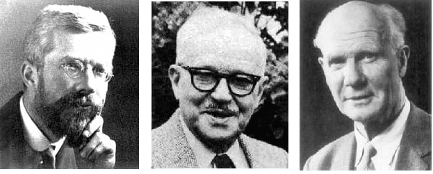
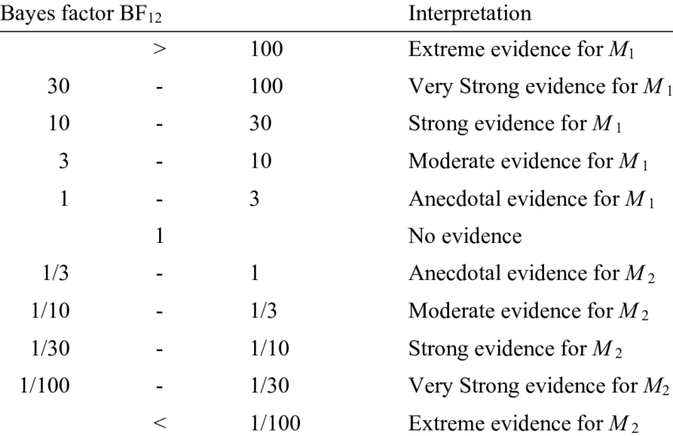
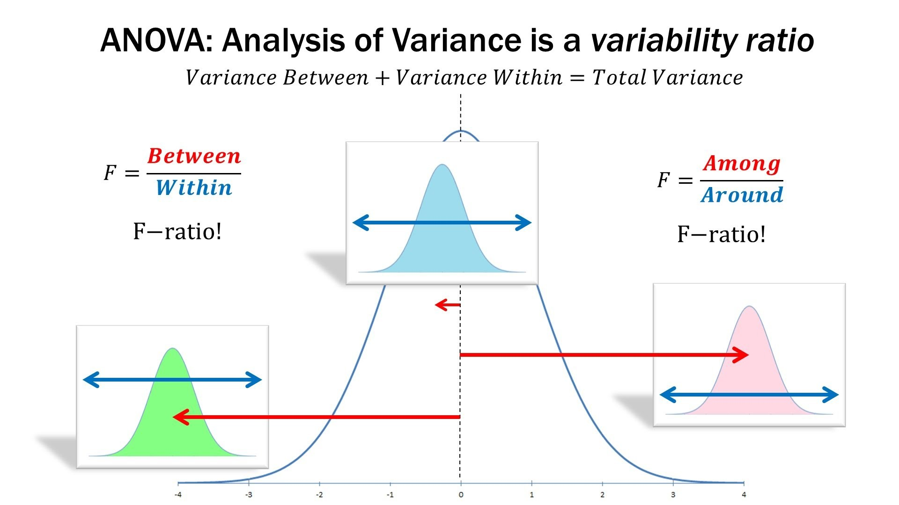
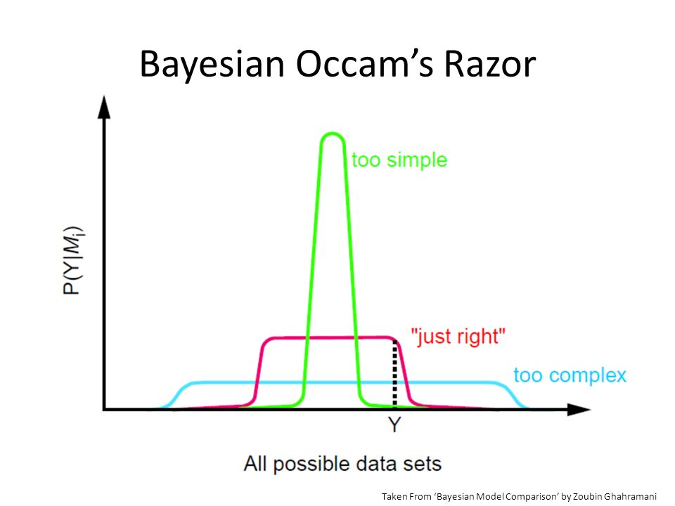
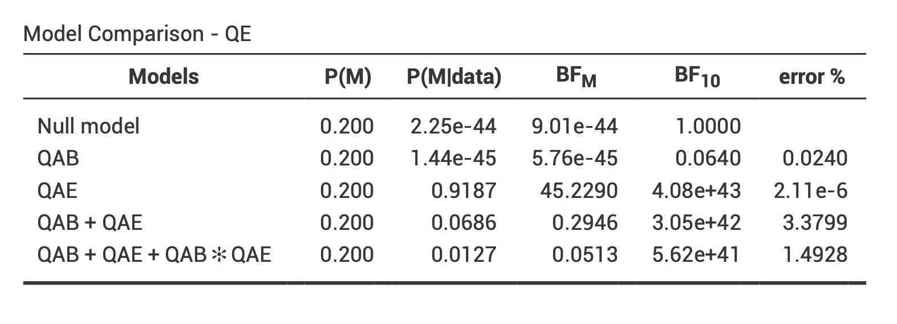
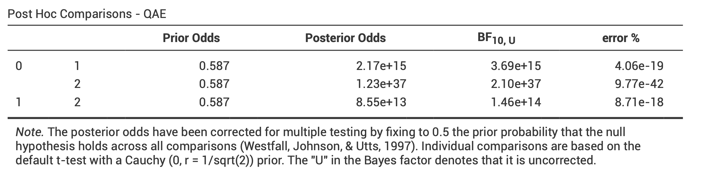

```{r xaringan-themer, include = FALSE}
library(xaringanthemer)

style_mono_accent(
    base_color = "#1c5253",
    header_font_google = google_font("Josefin Sans"),
    text_font_google = google_font("Montserrat", "300", "300i"),
    code_font_google = google_font("Droid Mono"),
    header_h1_font_size = "40px",
    header_h2_font_size = "35px",
    header_h3_font_size = "30px",
    text_font_size = "20px",
    code_font_size = "15px"
    )
```

# Au programme

```{r setup, include = FALSE}
library(tidyverse)
library(knitr)

# setting up knitr options
knitr::opts_chunk$set(
  cache = TRUE, echo = TRUE, warning = FALSE, message = FALSE,
  fig.align = "center", dev = "svg"
  )

# for interactive stuffs
options(htmltools.dir.version = FALSE)

# setting seed for reproducibility
set.seed(666)
```

```{r xaringanExtra-clipboard, echo = FALSE}
xaringanExtra::use_clipboard()
```

```{r xaringan-tachyons, echo = FALSE}
xaringanExtra::use_tachyons()
```

1. [Contexte théorique](#intro)
    + Interprétations du concept de probabilité
    + Qu'est-ce que l'inférence bayésienne ?
    + Rappels : Théorie des probabilités
    + Rappels : Test d'hypothèse fréquentiste
    + Test d'hypothèse bayésien
    + Analyse de la variance (ANOVA) bayésienne

2. [Travaux pratiques avec jamovi](#jamovi)
    + Présentation du module d'analyse bayésienne
    + Conduire une ANOVA bayésienne, interpréter, et rapporter les résultats
    
---
name: intro
class: middle, center

# Contexte théorique
## Interprétations du concept de probabilité

---

# Axiomes des probabilités (Kolmogorov, 1933)

Une probabilité est une valeur numérique assignée à un événement $A$, compris comme une possibilité appartenant à l'univers $\Omega$ (l'ensemble de toutes les issues possibles). Les probabilités se conforment aux axiomes suivants :

--
+ **Non-negativity :** $\Pr(A) \geq 0$
+ **Normalisation :** $\Pr(\Omega) = 1$
+ **Additivity (pour des événements incompatibles) :** $\Pr(A_{1} \cup A_{2}) = \Pr(A_{1}) + \Pr(A_{2})$

--

Le dernier axiome est également connu comme la **règle de la somme**, et peut se généraliser à des événements non mutuellement exclusifs : $\Pr(A_{1} \cup A_{2}) = \Pr(A_{1}) + \Pr(A_{2}) - \Pr(A_{1} \cap A_{2})$.

---

# Interprétations probabilistes

Quelle est la probabilité...

+ D'obtenir un chiffre pair sur un lancer de dé ?
+ Que j'apprenne quelque chose pendant ce cours ?

--

Est-ce qu'il s'agit, pour chaque exemple, de la même **sorte** de probabilité ?

```{r thinking, echo = FALSE, out.width = "50%"}

```

---

# Interprétation classique (ou théorique)

$$
\Pr(\text{pair}) = \frac{\text{nombre de cas favorables}}{\text{nombre de cas possibles}} = \frac{3}{6} = \frac{1}{2}
$$

Problème : cette définition est uniquement applicable aux situations dans lesquelles il n'y a qu'un nombre **fini** de résultats possibles **équiprobables**...

--

Quelle est la probabilité qu'il pleuve demain ?

$$\Pr(\text{pluie}) = \frac{\text{pluie}}{ \{ \text{pluie, non-pluie} \} } = \frac{1}{2}$$

---

# Interprétation fréquentiste (ou empirique)

$$\Pr(x) = \lim_{n_{t} \to \infty}\frac{n_{x}}{n_{t}}$$

Où $n_{x}$ est le nombre d'occurrences de l’événement $x$ et $n_{t}$ le nombre total d'essais. L'interprétation **fréquentiste** postule que, à long-terme (i.e., quand le nombre d'essais s'approche de l'infini), la fréquence relative va converger *exactement* vers ce qu'on appelle "probabilité".

--

Conséquence : le concept de probabilité s'applique uniquement aux **collectifs**, et non aux événements singuliers.

---

# Interprétation fréquentiste (ou empirique)

```{r frequency, fig.width = 7.5, fig.height = 5, out.width = "40%"}
library(tidyverse)

sample(c(0, 1), 500, replace = TRUE) %>% #<<
        data.frame %>%
        mutate(x = seq_along(.), y = cumsum(.) / seq_along(.) ) %>%
        ggplot(aes(x = x, y = y), log = "y") +
        geom_line(lwd = 1) +
        geom_hline(yintercept = 0.5, lty = 3) +
        labs(x = "Nombre de lancers", y = "Proportion de faces") +
        ylim(0, 1) + theme_bw(base_size = 20)
```

---

# Limites de l'interprétation fréquentiste...

Quelle classe de référence ? *Quelle est la probabilité que je vive jusqu'à 80 ans ? En tant qu'homme ? En tant que Français ?*

--

Quid des événements qui ne peuvent pas se répéter ? *Quelle est la probabilité que j'apprenne quelque chose pendant ce cours ?*

--

À partir de combien de lancers (d'une pièce par exemple) a-t-on une bonne approximation de la probabilité ? Une classe finie d’événements de taille $n$ ne peut produire que des fréquences relatives de précision $1/n$...

---

# Interprétation logique

<center>Il y a 10 étudiants dans cette salle</center>
<center>9 portent un t-shirt <font color = "green">vert</font></center>
<center>1 porte un t-shirt <font color = "red">rouge</font></center>
<center>Une personne est tirée au sort...</center>

--

<hr width = "75%%" size = "2" align = "center" noshade>

<center>Conclusion n°1 : l'étudiant tiré au sort porte un t-shirt &#10004; </center>

--

<hr width = "75%%" size = "1" align = "center" noshade>

<center>Conclusion n°2 : l'étudiant tiré au sort porte un t-shirt <font color = "green">vert</font> &#10007; </center>

--

<hr width = "75%%" size = "1" align = "center" noshade>

<center>Conclusion n°3 : l'étudiant tiré au sort porte un t-shirt <font color = "red">rouge</font> &#10007; </center>

---

# Interprétation logique

L'interprétation logique du concept de probabilité essaye de généraliser la logique (vrai / faux) au monde probabiliste. La probabilité représente donc le *degré de support logique* qu'une conclusion peut avoir, relativement à un ensemble de prémisses ([Keynes, 1921](https://archive.org/details/treatiseonprobab007528mbp); [Carnap, 1950](http://fitelson.org/confirmation/carnap_logical_foundations_of_probability.pdf)).

--

Conséquence : toute probabilité est **conditionnelle**.

---

# Interprétation bayésienne

**La probabilité est une mesure du degré d'incertitude**. Un événement *certain* aura donc une probabilité de 1 et un événement *impossible* aura une probabilité de 0.

--

Pour parler de probabilités, dans ce cadre, nous n'avons donc plus besoin de nous référer à la limite d'occurrence d'un événement (fréquence).

--

.bg-washed-green.b--dark-green.ba.bw2.br3.shadow-5.ph4.mt5[
So to assign equal probabilities to two events is not in any way an assertion that they must occur equally often in any random experiment [...], it is only a formal way of saying I don't know.

.tr[
[Edwin T. Jaynes (1986)](http://bayes.wustl.edu/etj/articles/general.background.pdf)
]]

---

# Interprétations probabilistes

+ Interprétation classique (Laplace, Bernouilli, Leibniz)
+ **Interprétation fréquentiste** (Venn, Reichenbach, von Mises)
+ Interprétation propensionniste (Popper, Miller)
+ Interprétation logique (Keynes, Carnap)
+ **Interprétation bayésienne** (Jeffreys, de Finetti, Savage)

*[Plus de détails sur la Stanford Encyclopedia of Philosophy...](http://plato.stanford.edu/entries/probability-interpret/)*

---

# Interprétations probabilistes - résumé

**Probabilité épistémique**
- Toute probabilité est conditionnelle à de l'information disponible (e.g., prémisses ou données)
- La probabilité comme moyen de quantifier l'incertitude
- Probabilité logique, probabilité bayésienne

--

**Probabilité physique**
- Les probabilités dépendent d'un état du monde, de caractéristiques physiques, elles sont indépendantes de l'information disponible (ou de l'incertitude)
- Probabilité classique, probabilité fréquentiste </center>

---
class: inverse, center, middle
background-image: url(figures/pill3.jpg)
background-size: cover

---
class: middle, center

# Contexte théorique
## Qu'est-ce que l'inférence bayésienne ?

---

# Exercice - Problème du sac de billes (McElreath, 2015)

Imaginons que nous disposions d'un sac contenant 4 billes. Ces billes peuvent être soit blanches, soit bleues. Nous savons qu'il y a précisément 4 billes, mais nous ne connaissons pas le nombre de billes de chaque couleur.

--

Nous savons cependant qu'il existe cinq possibilités (que nous considérons comme nos *hypothèses*) :

<br>

<p align = "center"> &#9898 &#9898 &#9898 &#9898</p>
<p align = "center"> &#128309 &#9898 &#9898 &#9898</p>
<p align = "center">&#128309 &#128309 &#9898 &#9898</p>
<p align = "center">&#128309 &#128309 &#128309 &#9898</p>
<p align = "center">&#128309 &#128309 &#128309 &#128309</p>

---

# Exercice - Problème du sac de billes (McElreath, 2015)

Le but est de déterminer quelle combinaison serait la plus probable, **sachant certaines observations**. Imaginons que l'on tire trois billes à la suite, avec remise, et que l'on obtienne la séquence suivante :

<p align = "center">&#128309 &#9898 &#128309</p>

--

Cette séquence représente nos données. À partir de là, quelle **inférence** peut-on faire sur le contenu du sac ? En d'autres termes, que peut-on dire de la probabilité de chaque hypothèse ?

<p align = "center"> &#9898 &#9898 &#9898 &#9898</p>
<p align = "center"> &#128309 &#9898 &#9898 &#9898</p>
<p align = "center">&#128309 &#128309 &#9898 &#9898</p>
<p align = "center">&#128309 &#128309 &#128309 &#9898</p>
<p align = "center">&#128309 &#128309 &#128309 &#128309</p>

--

```{r countdown1, eval = TRUE, echo = FALSE}
library(countdown)

countdown(
  minutes = 2, seconds = 0,
  warn_when = 15,
  play_sound = TRUE,
  left = 0, right = 0,
  # margin = "25%"
  # right = "50%"
  )
```

---

# Énumérer les possibilités

<p align = "center"> Hypothèse : &#128309 &#9898 &#9898 &#9898 &emsp;&emsp;&emsp;&emsp;&emsp;&emsp;&emsp;&emsp;&emsp;&emsp;&emsp;&emsp;&emsp;&emsp;&emsp;&emsp; Données : &#128309 </p>

```{r garden1, echo = FALSE, results = "hide", out.width = "75%"}
library(rethinking)
source("code/forking_data_McElreath.R")

dat <- c(1)
arc <- c(0, pi)

garden(
    arc = arc,
    possibilities = c(0, 0, 0, 1),
    data = dat,
    hedge = 0.05,
    ring_dist = ring_dist,
    alpha.fade = 1
    )
```

---

# Énumérer les possibilités

<p align = "center"> Hypothèse : &#128309 &#9898 &#9898 &#9898 &emsp;&emsp;&emsp;&emsp;&emsp;&emsp;&emsp;&emsp;&emsp;&emsp;&emsp;&emsp;&emsp;&emsp;&emsp;&emsp; Données : &#128309 &#9898</p>

```{r garden2, echo = FALSE, eval = TRUE, out.width = "75%"}
dat <- c(1, 0)
arc <- c(0, pi)

garden(
    arc = arc,
    possibilities = c(0, 0, 0, 1),
    data = dat,
    hedge = 0.05,
    ring_dist = ring_dist,
    alpha.fade = 1
    )
```

---

# Énumérer les possibilités

<p align = "center"> Hypothèse : &#128309 &#9898 &#9898 &#9898 &emsp;&emsp;&emsp;&emsp;&emsp;&emsp;&emsp;&emsp;&emsp;&emsp;&emsp;&emsp;&emsp;&emsp;&emsp;&emsp; Données : &#128309 &#9898 &#128309</p>

```{r garden3, echo = FALSE, eval = TRUE, out.width = "75%"}
dat <- c(1, 0, 1)
arc <- c(0, pi)

garden(
    arc = arc,
    possibilities = c(0, 0, 0, 1),
    data = dat,
    hedge = 0.05,
    ring_dist = ring_dist,
    alpha.fade = 1
    )
```

---

# Énumérer les possibilités

<p align = "center"> Hypothèse : &#128309 &#9898 &#9898 &#9898 &emsp;&emsp;&emsp;&emsp;&emsp;&emsp;&emsp;&emsp;&emsp;&emsp;&emsp;&emsp;&emsp;&emsp;&emsp;&emsp; Données : &#128309 &#9898 &#128309 </p>

```{r garden4, echo = FALSE, eval = TRUE, out.width = "75%"}
dat <- c(1, 0, 1)
arc <- c(0, pi)

garden(
    arc = arc,
    possibilities = c(0, 0, 0, 1),
    data = dat,
    hedge = 0.05,
    ring_dist = ring_dist,
    alpha.fade = 0.3
    )
```

---

# Énumérer les possibilités

Sous cette hypothèse, $3$ chemins (sur $4^{3} = 64$) conduisent au résultat obtenu. Qu'en est-il des autres hypothèses?

<p align = "center"> &#9898 &#9898 &#9898 &#128309 &emsp;&emsp;&emsp;&emsp; &#9898 &#128309 &#128309 &#128309 &emsp;&emsp;&emsp;&emsp; &#9898 &#9898 &#128309 &#128309 </p>

```{r garden5, echo = FALSE, eval = TRUE, out.width = "40%"}
dat <- c(1, 0, 1)
ac <- c(1.2, 0.9, 0.6)

arc <- c( pi / 2, pi / 2 + (2 / 3) * pi)

garden(
    arc = arc,
    possibilities = c(1, 0, 0, 0),
    data = dat,
    hedge = 0.05,
    adj.cex = ac) 

arc <- c(arc[2], arc[2] + (2 / 3) * pi)

garden(
    arc = arc,
    possibilities = c(1, 1, 0, 0),
    data = dat,
    hedge = 0.05,
    newplot = FALSE,
    adj.cex = ac)

arc <- c(arc[2], arc[2] + (2 / 3) * pi)

garden(
    arc = arc,
    possibilities = c(1, 1, 1, 0),
    data = dat,
    hedge = 0.05,
    newplot = FALSE,
    adj.cex = ac)

line.polar(c(0, 2), pi / 2, lwd = 1)
line.polar(c(0, 2), pi / 2 + (2 / 3) * pi, lwd = 1)
line.polar(c(0, 2), pi / 2 + 2 * (2 / 3) * pi, lwd = 1)
```

---

# Comparer les hypothèses

Au vu des données, cette hypothèse est la plus *probable* car c'est l'hypothèse qui **maximise le nombre de manières possibles d'obtenir les données obtenues**.

<center>

<style type="text/css">
.tg  {border-collapse:collapse;border-spacing:0;}
.tg .tg-gq9a{font-family:"Lucida Sans Unicode", "Lucida Grande", sans-serif !important;;text-align:center;font-size:16px;font-weight:normal;padding:5px 5px 5px 5px}
</style>
<table class="tg" width="600" height="200">
  <tr>
    <th class="tg-gq9a">Hypothèse</th>
    <th class="tg-gq9a">Façons d'obtenir les données</th>
  </tr>
  <tr>
    <td class="tg-gq9a"> <p> &#9898 &#9898 &#9898 &#9898 </p></td>
    <td class="tg-gq9a"> 0 x 4 x 0 = 0</td>
  </tr>
  <tr>
    <td class="tg-gq9a"><p> &#128309 &#9898 &#9898 &#9898 </p></td>
    <td class="tg-gq9a">1 x 3 x 1 = 3</td>
  </tr>
  <tr>
    <td class="tg-gq9a"><p> &#128309 &#128309 &#9898 &#9898 </p></td>
    <td class="tg-gq9a">2 x 2 x 2 = 8</td>
  </tr>
  <tr>
    <td class="tg-gq9a"><p> &#128309 &#128309 &#128309 &#9898 </p></td>
    <td class="tg-gq9a">3 x 1 x 3 = 9</td>
  </tr>
  <tr>
    <td class="tg-gq9a"><p> &#128309 &#128309 &#128309 &#128309 </p></td>
    <td class="tg-gq9a">4 x 0 x 4 = 0</td>
  </tr>
</table>

</center>

---

# Accumulation d'évidence

Dans le cas précédent, nous avons considéré que toutes les hypothèses étaient équiprobables a priori (suivant le [principe d'indifférence](https://en.wikipedia.org/wiki/Principle_of_indifference)).

--

Cependant, on pourrait avoir de l'information a priori, provenant de nos connaissances (des particularités des sacs de billes par exemple) ou de données antérieures.

--

Imaginons que nous tirions une nouvelle bille du sac, comment incorporer cette nouvelle donnée ?

---

# Accumulation d'évidence

Il suffit d'appliquer la même stratégie que précédemment, et de mettre à jour le dernier compte en le multipliant par ces nouvelles données. *Yesterday's posterior is today's prior* ([Lindley, 2000](https://rss.onlinelibrary.wiley.com/doi/abs/10.1111/1467-9884.00238)).

<center>

<style type="text/css">
.tg  {border-collapse:collapse;border-spacing:0;}
.tg .tg-gq9a{font-family:"Lucida Sans Unicode", "Lucida Grande", sans-serif !important;;text-align:center;font-size:16px;font-weight:normal;padding:5px 5px 5px 5px}
</style>
<table class="tg" width="600" height="200">
  <tr>
    <th class="tg-gq9a">Hypothèse</th>
    <th class="tg-gq9a"><p>Façons de produire &#128309</p></th>
    <th class="tg-gq9a">Compte précédent</th>
    <th class="tg-gq9a">Nouveau compte</th>
  </tr>
  <tr>
    <td class="tg-gq9a"><p> &#9898 &#9898 &#9898 &#9898 </p></td>
    <td class="tg-gq9a">0</td>
    <td class="tg-gq9a">0</td>
    <td class="tg-gq9a">0 x 0 = 0</td>
  </tr>
  <tr>
    <td class="tg-gq9a"><p> &#128309 &#9898 &#9898 &#9898 </p></td>
    <td class="tg-gq9a">1</td>
    <td class="tg-gq9a">3</td>
    <td class="tg-gq9a">3 x 1 = 3</td>
  </tr>
  <tr>
    <td class="tg-gq9a"><p> &#128309 &#128309 &#9898 &#9898 </p></td>
    <td class="tg-gq9a">2</td>
    <td class="tg-gq9a">8</td>
    <td class="tg-gq9a">8 x 2 = 16</td>
  </tr>
  <tr>
    <td class="tg-gq9a"><p> &#128309 &#128309 &#128309 &#9898 </p></td>
    <td class="tg-gq9a">3</td>
    <td class="tg-gq9a">9</td>
    <td class="tg-gq9a">9 x 3 = 27</td>
  </tr>
  <tr>
    <td class="tg-gq9a"><p> &#128309 &#128309 &#128309 &#128309 </p></td>
    <td class="tg-gq9a">4</td>
    <td class="tg-gq9a">0</td>
    <td class="tg-gq9a">0 x 4 = 0</td>
  </tr>
</table>

</center>

---

# Incorporer un prior

Un employé de l'usine de fabrication des billes nous dit que pour chaque sac contenant 3 billes bleues, ils fabriquent deux sacs en contenant seulement deux, et trois sacs en contenant seulement une. Il nous apprend également que tous les sacs contiennent au moins une bille bleue et une bille blanche...

<center>

<style type="text/css">
.tg  {border-collapse:collapse;border-spacing:0;}
.tg .tg-gq9a{font-family:"Lucida Sans Unicode", "Lucida Grande", sans-serif !important;;text-align:center;font-size:16px;font-weight:small;padding:5px 5px 5px 5px}
</style>
<table class="tg" width="600" height="200">
  <tr>
    <th class="tg-gq9a">Hypothèse</th>
    <th class="tg-gq9a"><p>Comptes précédents</p></th>
    <th class="tg-gq9a">Prior usine</th>
    <th class="tg-gq9a">Nouveau compte</th>
  </tr>
  <tr>
    <td class="tg-gq9a"><p> &#9898 &#9898 &#9898 &#9898 </p></td>
    <td class="tg-gq9a">0</td>
    <td class="tg-gq9a">0</td>
    <td class="tg-gq9a">0 x 0 = 0</td>
  </tr>
  <tr>
    <td class="tg-gq9a"><p> &#128309 &#9898 &#9898 &#9898 </p></td>
    <td class="tg-gq9a">3</td>
    <td class="tg-gq9a">3</td>
    <td class="tg-gq9a">3 x 3 = 9</td>
  </tr>
  <tr>
    <td class="tg-gq9a"><p> &#128309 &#128309 &#9898 &#9898 </p></td>
    <td class="tg-gq9a">16</td>
    <td class="tg-gq9a">2</td>
    <td class="tg-gq9a">16 x 2 = 32</td>
  </tr>
  <tr>
    <td class="tg-gq9a"><p> &#128309 &#128309 &#128309 &#9898 </p></td>
    <td class="tg-gq9a">27</td>
    <td class="tg-gq9a">1</td>
    <td class="tg-gq9a">27 x 1 = 27</td>
  </tr>
  <tr>
    <td class="tg-gq9a"><p> &#128309 &#128309 &#128309 &#128309 </p></td>
    <td class="tg-gq9a">0</td>
    <td class="tg-gq9a">0</td>
    <td class="tg-gq9a">0 x 0 = 0</td>
  </tr>
</table>

</center>

---

# Des énumérations aux probabilités

La probabilité d'une hypothèse après avoir observé certaines données est proportionnelle au nombre de façons qu'a cette hypothèse de produire les données observées, multiplié par sa probabilité a priori.

$$
\Pr(\text{hypothèse}\ |\ \text{données}) \propto \Pr(\text{données}\ |\ \text{hypothèse}) \times \Pr(\text{hypothèse})
$$

--

Pour calculer la probabilité d'une hypothèse, il suffit de standardiser ce produit (i.e., nombre de façons de produire les données multiplié par la probabilité a priori de l'hypothèse) de manière à ce que la somme des probabilités de toutes les hypothèses possibles soit égale à $1$.

$$
\Pr(\text{hypothèse}\ |\ \text{données}) = \frac{\Pr(\text{données}\ |\ \text{hypothèse})\times \Pr(\text{hypothèse})}{\text{somme des produits}}
$$

---

# Des énumérations aux probabilités

Par exemple, définissons $p$ comme la proportion de billes bleues.

<center>

<style type="text/css">
.tg  {border-collapse:collapse;border-spacing:0;}
.tg .tg-gq9a{font-family:"Lucida Sans Unicode", "Lucida Grande", sans-serif !important;;text-align:center;font-size:18px;font-weight:normal;padding:5px 5px 5px 5px}
</style>
<table class="tg">
  <tr>
    <th class="tg-gq9a">Hypothèse</th>
    <th class="tg-gq9a">p</th>
    <th class="tg-gq9a">Manières de produire les données</th>
    <th class="tg-gq9a">Probabilité</th>
  </tr>
  <tr>
    <td class="tg-gq9a"> &#9898 &#9898 &#9898 &#9898 </td>
    <td class="tg-gq9a">0</td>
    <td class="tg-gq9a">0</td>
    <td class="tg-gq9a">0</td>
  </tr>
  <tr>
    <td class="tg-gq9a"> &#128309 &#9898 &#9898 &#9898 </td>
    <td class="tg-gq9a">0.25</td>
    <td class="tg-gq9a">3</td>
    <td class="tg-gq9a">0.15</td>
  </tr>
  <tr>
    <td class="tg-gq9a"> &#128309 &#128309 &#9898 &#9898 </td>
    <td class="tg-gq9a">0.5</td>
    <td class="tg-gq9a">8</td>
    <td class="tg-gq9a">0.40</td>
  </tr>
  <tr>
    <td class="tg-gq9a"> &#128309 &#128309 &#128309 &#9898 </td>
    <td class="tg-gq9a">0.75</td>
    <td class="tg-gq9a">9</td>
    <td class="tg-gq9a">0.45</td>
  </tr>
  <tr>
    <td class="tg-gq9a"> &#128309 &#128309 &#128309 &#128309 </td>
    <td class="tg-gq9a">1</td>
    <td class="tg-gq9a">0</td>
    <td class="tg-gq9a">0</td>
  </tr>
</table>

</center>

--

```{r ways, echo = TRUE, eval = TRUE}
chemins <- c(0, 3, 8, 9, 0)
(probs <- chemins / sum(chemins) )
```

---

# Notations, terminologie


- $\theta$ est un paramètre ou vecteur de paramètres (e.g., la proportion de billes bleues).
- $\color{orangered}{p(x\vert \theta)}$ <span style="color:orangered"> la probabilité conditionnelle des données $x$ sachant le paramètre $\theta$ $\color{orangered}{[p(x | \theta = \theta)]}$. </span>
- $\color{orangered}{p(x\vert \theta)}$ <span style="color:orangered"> une fois que la valeur de $x$ est connue, est vue comme la fonction de vraisemblance (*likelihood*) du paramètre $\theta$. Attention, il ne s'agit pas d'une distribution de probabilité $\color{orangered}{[p(x = x | \theta)]}$. </span>
- $\color{steelblue}{p(\theta)}$ <span style="color:steelblue"> la probabilité a priori de $\theta$.</span>
- $\color{purple}{p(\theta \vert x)}$ <span style="color:purple"> la probabilité a posteriori de $\theta$ (sachant $x$).</span>
- $\color{green}{p(x)}$ <span style="color:green"> la probabilité marginale de $x$ (sur $\theta$) ou "vraisemblance marginale", "vraisemblance intégrée".</span>

<br>

$$\color{purple}{p(\theta \vert x)} = \dfrac{\color{orangered}{p(x\vert \theta)} \color{steelblue}{p(\theta)}}{\color{green}{p(x)}} = \dfrac{\color{orangered}{p(x\vert \theta)} \color{steelblue}{p(\theta)}}{\color{green}{\sum\limits_{\theta}p(x|\theta)p(\theta)}} = \dfrac{\color{orangered}{p(x\vert \theta)} \color{steelblue}{p(\theta)}}{\color{green}{\int\limits_{\theta}p(x|\theta)p(\theta)\mathrm{d}x}} \propto \color{orangered}{p(x\vert \theta)} \color{steelblue}{p(\theta)}$$

---
class: middle, center

# Contexte théorique
## Rappels : Théorie des probabilités

---

# Loi de probabilité, cas discret

Une fonction de masse (*probability mass function*, ou *PMF*) est une fonction qui attribue une probabilité à chaque valeur d'une variable aléatoire. Exemple de la distribution binomiale pour une pièce non biaisée, c'est à dire lorsque $\theta = 0.5$, qui nous indique la probabilité d'obtenir $N$ faces sur 10 lancers. 

```{r echo = FALSE, fig.align = "center", dev = "svg", fig.width = 6, fig.height = 3, out.width = "50%"}
coin <- dbinom(x = 0:10, size = 10, prob = 0.5)
barplot(coin, names.arg = 0:10, border = NA, axes = FALSE, cex.names = 1.5, col = "grey20")
```

--

```{r eval = TRUE, echo = TRUE}
# PMFs sum to 1
dbinom(x = 0:10, size = 10, prob = 0.5) %>% sum
```

---

# Loi de probabilité, cas continu

Une (fonction de) densité de probabilité (*probability density function*, ou *PDF*), est une fonction qui permet de représenter une loi de probabilité sous forme d'intégrales (l'équivalent de la PMF pour des variables aléatoires strictement continues).

```{r echo = FALSE, fig.align = "center", dev = "svg", fig.width = 6, fig.height = 3, out.width = "50%"}
data.frame(x = c(0, 200) ) %>%
    ggplot(aes(x) ) +
    stat_function(
        fun = dnorm,
        args = list(mean = 100, sd = 15),
        lwd = 1.5
        ) +
    theme_bw(base_size = 16) +
    xlab("QI") + ylab("Densité de probabilité")
```

--

```{r echo = TRUE}
# PDFs integrate to 1
integrate(dnorm, -Inf, Inf, mean = 100, sd = 15)
```

---

# Aparté, qu'est-ce qu'une intégrale ?

Une intégrale correspond à la **surface** (aire géométrique) délimitée par la représentation graphique d'une fonction, *l'aire sous la courbe*. Une distribution est dite **impropre** si son intégrale n'est pas égale à un nombre fini (e.g., $+ \infty$) et **normalisée** si son intégrale est égale à 1.

```{r message = FALSE, echo = FALSE, dev = "svg", fig.align = "center", fig.width = 6, fig.height = 4, out.width = "50%"}
cord.x <- c(90, seq(90, 96, 0.01), 96) 
cord.y <- c(0, dnorm(seq(90, 96, 0.01), 100, 15), 0) 

data.frame(x = c(0, 200) ) %>%
    ggplot(aes(x) ) +
    stat_function(
        fun = dnorm,
        args = list(mean = 100, sd = 15),
        lwd = 2,
        color = "black"
        ) +
    geom_polygon(
        data = data.frame(cord.x, cord.y),
        aes(cord.x, cord.y),
        color = "black"
        ) +
    theme_bw(base_size = 16) +
    xlab("QI") + ylab("Densité de probabilité")
```

---

# Aparté, qu'est-ce qu'une intégrale ?

```{r message = FALSE, echo = FALSE, fig.align = "center", dev = "svg", fig.width = 6, fig.height = 4, out.width = "50%"}
data.frame(x = c(0, 200) ) %>%
    ggplot(aes(x) ) +
    stat_function(
        fun = dnorm,
        args = list(mean = 100, sd = 15),
        lwd = 2
        ) +
    geom_polygon(
        data = data.frame(cord.x, cord.y),
        aes(cord.x, cord.y)
        ) +
    theme_bw(base_size = 16) +
    xlab("QI") + ylab("Densité de probabilité")
```

L'intégrale de $f(x)$ sur l'intervalle [90 ; 96] vaut : $p(90 < x < 96) = \int_{90}^{96} f(x) \ \mathrm{d}x = 0.142$.

```{r eval = TRUE, echo = TRUE, fig.align = "center", fig.width = 8, fig.height = 6}
integrate(dnorm, 90, 96, mean = 100, sd = 15)
```

---

# Probabilité conjointe

```{r, message = FALSE, echo = TRUE} 
library(tidyverse)
data(HairEyeColor) # data adapted from Snee (1974)

cont <- apply(HairEyeColor, c(1, 2), sum) %>% t 
cont <- round(cont / sum(cont), 2)
cont
```

Dans chaque cellule, on trouve la **probabilité conjointe** d'avoir telle couleur de cheveux **ET** telle couleur d'yeux, qui s'écrit $p(c, y) = p(y, c)$.

---

# Probabilité marginale

```{r, echo = TRUE} 
cont2 <- cont %>% as.data.frame %>% mutate(marginal_eye = rowSums(cont) )
rownames(cont2) <- row.names(cont)
cont2
```

On peut aussi s'intéresser à la probabilité d'avoir des yeux bleus, de manière générale. Il s'agit de la probabilité **marginale** de l'événement *yeux bleus*, qui s'obtient par la somme de toutes les probabilités jointes impliquant l'événement *yeux bleus*. Elle s'écrit $p(y)=\sum\limits_{c}p(y|c)p(c)$.

---

# Probabilité marginale

```{r, echo = TRUE, eval = TRUE} 
cont3 <- rbind(cont2, colSums(cont2) )
rownames(cont3) <- c(row.names(cont2), "marginal_hair")
cont3
```

On peut bien entendu aussi s'intéresser aux probabilités des couleurs de cheveux, de manière générale. Elle s'écrit $p(c) = \sum\limits_{y} p(c | y) p(y)$.

---

# Probabilité conditionnelle

On pourrait aussi s'intéresser à la probabilité qu'une personne ait les cheveux blonds, **sachant** qu'elle a les yeux bleus. Il s'agit d'une probabilité **conditionnelle**, et s'écrit $p(c|y)$. Cette probabilité conditionnelle peut se ré-écrire : $p(c | y) = \frac{p(c, y)}{p(y)}$.

```{r, echo = FALSE, eval = TRUE} 
cont3["Blue", ]
```

--

Par exemple, quelle est la probabilité d'avoir des yeux bleus lorsqu'on a les cheveux blonds ?

```{r, echo = TRUE, eval = TRUE} 
cont3["Blue", "Blond"] / cont3["Blue", "marginal_eye"]  
```

---

# Probabilité conditionnelle, règle du produit

On remarque dans le cas précédent que $p(blonds|bleus)$ **n'est pas nécessairement égal** à $p(bleus|blonds)$.

--

<iframe
align="right" border=0 frameborder=0 height=400 width=600
src="https://twitframe.com/show?url=https://twitter.com/BillGates/status/1118196606975787008">
</iframe>

Autre exemple : la probabilité de mourir sachant qu'on a été attaqué par un requin n'est pas la même que la probabilité d'avoir été attaqué par un requin, sachant qu'on est mort ([*confusion of the inverse*](https://en.wikipedia.org/wiki/Confusion_of_the_inverse)). De la même manière, $p(data|H_{0}) \neq p(H_{0}|data)$.

--

À partir des axiomes de Kolmogorov (cf. début du cours), et des définitions précédentes des probabilités conjointes, marginales, et conditionnelles, découle la **règle du produit** :

$$p(a, b) = p(b) \times p(a|b) = p(a) \times p(b|a)$$

---

# Dérivation du théorème de Bayes

$$p(x,y) = p(x|y) \times p(y) = p(y|x) \times p(x)$$

--

$$p(y|x) \times p(x) = p(x|y) \times p(y)$$

--

$$p(y|x) = \dfrac{p(x|y) \times p(y)}{p(x)}$$

--

$$p(x|y) = \dfrac{p(y|x) \times p(x)}{p(y)}$$

--

$$\Pr(\text{hypothèse}\ |\ \text{données}) = \frac{\Pr(\text{données}\ |\ \text{hypothèse})\times \Pr(\text{hypothèse})}{\text{somme des produits}}$$
---
class: middle, center

# Contexte théorique
## Rappels : Test d'hypothèse fréquentiste

---

# Null Hypothesis Significance Testing (NHST)

On s'intéresse aux différences de taille entre hommes et femmes. On va mesurer 100 femmes et 100 hommes.

```{r eval = TRUE, echo = TRUE}
men <- rnorm(100, 175, 10) # 100 tailles d'hommes
women <- rnorm(100, 170, 10) # 100 tailles de femmes
```

--

```{r eval = TRUE, echo = TRUE}
t.test(x = men, y = women)
```

---

# Null Hypothesis Significance Testing (NHST)

On va simuler des t-valeurs issues de données générées sous l'hypothèse d'une absence de différence entre hommes et femmes.

```{r eval = TRUE, echo = TRUE}
nsims <- 1e4 # nombre de simulations
t <- rep(NA, nsims) # initialisation d'un vecteur vide

for (i in 1:nsims) {
    
    men2 <- rnorm(100, 170, 10) # 100 tailles d'hommes
    women2 <- rnorm(100, 170, 10) # 100 tailles de femmes
    t[i] <- t.test(men2, women2)$statistic # on conserve la t-valeur
    
}
```

--

Ou sans boucle `for`.

```{r eval = TRUE, echo = TRUE}
t <- replicate(n = nsims, expr = t.test(x = rnorm(100, 170, 10), y = rnorm(100, 170, 10) )$statistic)
```

---

# Null Hypothesis Significance Testing (NHST)

```{r eval = TRUE, echo = TRUE, fig.align = "center", out.width = "40%"}
data.frame(t = t) %>%
  ggplot(aes(x = t) ) +
  geom_histogram() +
  theme_bw(base_size = 20) +
  labs(x = "Valeur de t", y = "Nombre d'échantillons")
```

---

# Null Hypothesis Significance Testing (NHST)

```{r eval = TRUE, echo = TRUE, out.width = "40%"}
data.frame(t = c(-5, 5) ) %>%
  ggplot(aes(x = t) ) +
  stat_function(fun = dt, args = list(df = t.test(men, women)$parameter), size = 1.5) +
  theme_bw(base_size = 20) +
  labs(x = "Valeur de t", y = "Densité de probabilité")
```

---

# Null Hypothesis Significance Testing (NHST)

```{r eval = TRUE, echo = TRUE}
alpha <- .05
abs(qt(alpha / 2, df = t.test(x = men, y = women)$parameter) ) # valeur de t critique
```

```{r eval = TRUE, echo = FALSE, out.width = "40%"}
data.frame(t = c(-5, 5) ) %>%
    ggplot(aes(x = t) ) +
    stat_function(fun = dt, args = list(df = t.test(men, women)$parameter), size = 1.5) +
    stat_function(
        fun = dt, args = list(df = t.test(men, women)$parameter),
        xlim = c(-5, qt(0.025, df = t.test(men, women)$parameter) ),
        geom = "area", alpha = 0.5
        ) +
    stat_function(
        fun = dt, args = list(df = t.test(men, women)$parameter),
        xlim = c(qt(0.975, df = t.test(men, women)$parameter), 5),
        geom = "area", alpha = 0.5
        ) +
    theme_bw(base_size = 20) +
  labs(x = "Valeur de t", y = "Densité de probabilité")
```

---

# Null Hypothesis Significance Testing (NHST)

```{r eval = TRUE, echo = TRUE}
tobs <- t.test(x = men, y = women)$statistic # valeur de t observée
tobs %>% as.numeric
```

```{r eval = TRUE, echo = FALSE, out.width = "40%"}
data.frame(t = c(-5, 5) ) %>%
    ggplot(aes(x = t) ) +
    stat_function(fun = dt, args = list(df = t.test(men, women)$parameter), size = 1.5) +
    stat_function(
        fun = dt, args = list(df = t.test(men, women)$parameter),
        xlim = c(-5, qt(0.025, df = t.test(men, women)$parameter) ),
        geom = "area", alpha = 0.5
            ) +
    stat_function(
        fun = dt, args = list(df = t.test(men, women)$parameter),
        xlim = c(qt(0.975, df = t.test(men, women)$parameter), 5),
        geom = "area", alpha = 0.5
        ) +
    stat_function(
        fun = dt, args = list(df = t.test(men, women)$parameter),
        xlim = c(-5, - tobs),
        geom = "area") +
    stat_function(
        fun = dt, args = list(df = t.test(men, women)$parameter),
        xlim = c(tobs, 5),
        geom = "area") +
    theme_bw(base_size = 20) +
  labs(x = "Valeur de t", y = "Densité de probabilité")
```

---

# P-values

La p-valeur (p-value) est une aire sous la courbe, une intégrale, sous la distribution de statistiques de test sous l'hypothèse nulle (i.e., étant admis que l'hypothèse nulle est vraie). La p-valeur indique la probabilité d'observer la valeur de la statistique de test observée, ou une valeur plus extrême, sous l'hypothèse nulle.

$$p[\mathbf{t}(\mathbf{x}^{\text{rep}}|H_{0}) \geq t(x)]$$

--

```{r eval = TRUE, echo = TRUE}
t.test(x = men, y = women)$p.value
```

--

```{r eval = TRUE, echo = TRUE}
tvalue <- abs(t.test(x = men, y = women)$statistic)
df <- t.test(x = men, y = women)$parameter
2 * integrate(f = dt, lower = tvalue, upper = Inf, df = df)$value
```

---

# Fisher versus Neyman & Pearson

```{r echo = FALSE, fig.align = "center", out.width = "33%"}

```

.pull-left[
Fisher utilisait la p-valeur pour quantifier l'évidence *contre* l'hypothèse nulle. Plus petite est la p-valeur, plus forte est l'évidence contre l'hypothèse nulle. Cette interprétation "continue" de la p-valeur a été très largement critiquée (cf. slide suivante et [Wagenmakers, 2007](http://www.ejwagenmakers.com/2007/pValueProblems.pdf)).
]

--

.pull-right[
Neyman & Pearson proposèrent d'utiliser la p-valeur de manière à *contrôler* les erreurs de type 1 (faux positifs) et de type 2 (faux négatifs) sur le long terme (in the long run). Avec cette méthode, on n'interprète pas la p-valeur de manière continue, mais on classifie simplement les résultats comme "significatifs" ou "non-significatifs" en fonction d'un seuil pré-défini. Cette procédure a aussi de nombreux problèmes. Un problème majeur est celui du *domain problem* (e.g., [Trafimow & Earp, 2017](https://www.sciencedirect.com/science/article/pii/S0732118X16301076?via%3Dihub)).
]

---

# Logique, fréquentisme, et raisonnement probabiliste

Le *modus tollens* est un des raisonnements logiques les plus importants et les plus performants. Dans le cadre de l'inférence statistique, il s'applique parfaitement au cas suivant : "Si $H_{0}$ est vraie, alors $x$ ne devrait pas se produire. On observe $x$. Alors $H_{0}$ est fausse".

MAIS nous avons le plus souvent affaire à des hypothèses "continues", probabilistes.

--

L'inférence fréquentiste (Fishérienne) est elle aussi probabiliste, de la forme "Si $H_{0}$ est vraie, alors $x$ est peu probable. On observe $x$. Alors $H_{0}$ est peu probable."

--

Or cet argument est invalide, le *modus tollens* ne s'applique pas au monde probabiliste (e.g., [Pollard & Richardson, 1987](http://citeseerx.ist.psu.edu/viewdoc/download?doi=10.1.1.505.9968&rep=rep1&type=pdf); [Rouder, Morey, Verhagen, Province, & Wagenmakers, 2016](http://www.ejwagenmakers.com/2016/RouderEtAl2016FreeLunch.pdf)). 

Par exemple : *Si un individu est un homme, alors il est peu probable qu'il soit pape. François est pape. François n'est donc certainement pas un homme...*

---
class: middle, center

# Contexte théorique
## Test d'hypothèse bayésien

---

# Facteur de Bayes

Au lieu de tester une seule hypothèse (i.e., l'hypothèse nulle), on compare deux modèles :

- $H_{0}: \mu_{1} = \mu_{2} \rightarrow \delta = 0$
- $H_{1}: \mu_{1} \neq \mu_{2} \rightarrow \delta \neq 0$

--

$$\underbrace{\dfrac{p(H_{0}|D)}{p(H_{1}|D)}}_{\text{Posterior model odds}} = \underbrace{\dfrac{p(D|H_{0})}{p(D|H_{1})}}_{\text{Bayes factor BF}_{01}} \times \underbrace{\dfrac{p(H_{0})}{p(H_{1})}}_{\text{Prior model odds}}$$

--

$$\text{evidence}\ = p(D|H) = \int p(\theta|H) p(D|\theta, H) \text{d}\theta$$

L'évidence en faveur d'un modèle correspond à la *vraisemblance marginale* d'un modèle (le dénominateur du théorème de Bayes), c'est à dire à la vraisemblance moyennée sur le prior... Ce qui fait du facteur de Bayes un ratio de vraisemblances, pondéré par (ou moyenné sur) le prior.

---

# Facteur de Bayes, exemple d'application

On lance une pièce 100 fois et on essaye d'estimer la probabilité $\theta$ (le biais de la pièce) d'obtenir Face. On compare deux modèles qui diffèrent par leur prior sur $\theta$.

$$
\begin{align}
\mathcal{M_{1}} : y_{i} &\sim \mathrm{Binomial}(n, \theta) \\
\theta &\sim \mathrm{Beta}(6, 10) \\
\end{align}
$$

$$
\begin{align}
\mathcal{M_{2}} : y_{i} &\sim \mathrm{Binomial}(n, \theta) \\
\theta &\sim \mathrm{Beta}(20, 12) \\
\end{align}
$$

```{r, echo = FALSE, fig.width = 10, fig.height = 5, out.width = "60%"}
data.frame(x = seq(from = 0, to = 1, length.out = 1e2) ) %>%
    mutate(M1 = dbeta(x, 6, 10), M2 = dbeta(x, 20, 12) ) %>%
    gather(prior, value, M1:M2) %>%
    ggplot(aes(x = x, y = value, fill = prior) ) +
    geom_area(alpha = 0.75, position = "identity") +
    scale_fill_manual(values = c("#016392", "#c72e29") ) +
    xlab(expression(paste("Probabilité d'obtenir Face ", theta) ) ) +
    ylab("Densité de probabilité") +
    theme_bw(base_size = 20)
```

---

# Facteur de Bayes, exemple d'application

```{r echo = FALSE, fig.align = "center", out.width = "50%"}
knitr::include_graphics("figures/bf.gif")
```

---

# Le facteur de Bayes est la nouvelle p-valeur

Attention à ne pas interpréter le BF comme un *posterior odds*...

Le BF est un facteur qui nous indique de combien nos *prior odds* doivent changer, au vue des données. Il ne nous dit pas quelle est l'hypothèse la plus probable, sachant les données (sauf si les *prior odds* sont 1:1).

--

Considérons un autre exemple :

- $H_{0}$: la précognition n'existe pas !
- $H_{1}$: la précognition existe

On fait une expérience et on calcule un $BF_{10} = 27$. Quelle est la probabilité a posteriori de H1 ?

--

$$\underbrace{\dfrac{p(H_{1}|D)}{p(H_{0}|D)}}_{\text{Posterior model odds}} = \underbrace{\dfrac{27}{1}}_{\text{Bayes factor BF}_{10}} \times \underbrace{\dfrac{1}{1000}}_{\text{Prior model odds}} = \dfrac{27}{1000} = 0.027$$
---

# Grille de lecture

Bien que le BF s'interprète de manière continue, des grilles d'interprétation ont été proposées.

```{r grid, echo = FALSE, out.width = "50%"}

```

---

# Attention au double sens

Dans le cadre bayésien, le terme de *prior* peut faire référence soit :

* À la probabilité *a priori* ou *a posteriori* d'un modèle (par rapport à un autre modèle), c'est à dire $\Pr(M_{i})$. Voir cet [article de blog](http://www.nicebread.de/two-meanings-of-priors-1/).

--

* Aux prédictions d'un modèle, par exemple $\theta \sim \mathrm{Normal}(0, 10)$. Voir cet [article de blog](http://www.nicebread.de/two-meanings-of-priors-2/).

```{r eval = TRUE, echo = FALSE, fig.align = "center", fig.width = 7.5, fig.height = 5, out.width = "50%"}
data.frame(x = c(-20, 20) ) %>%
    ggplot(aes(x = x) ) +
    stat_function(fun = dnorm, args = list(mean = 0, sd = 1), size = 1.5) +
    stat_function(fun = dnorm, args = list(mean = 0, sd = 2), size = 1.5) +
    stat_function(fun = dnorm, args = list(mean = 0, sd = 5), size = 1.5) +
    stat_function(fun = dnorm, args = list(mean = 0, sd = 10), size = 1.5) +
    theme_bw(base_size = 20) +
    labs(x = expression(theta), y = "Densité de probabilité")
```

---
class: middle, center

# Contexte théorique
## Analyse de la variance (ANOVA) bayésienne

---

# Analyse de la variance (ANOVA) fréquentist

L'ANOVA fréquentiste implique une comparaison de variances. On compare la variance *entre* les différents niveaux d'un prédicteur (variance inter) à la variance *au sein* de ces niveaux (variance intra). Lorsqu'un prédicteur catégoriel n'a pas d'effet, la variance (dans la population) entre les niveaux est égale à la variance (dans la population) au sein des niveaux. Le ratio de ces variances est distribué selon une loi de Fisher-Snedecor. Sous l'hypothèse nulle, on peut calculer (comme nous l'avons fait pour le t-test), la probabilité d'obtenir un ratio de variances au moins aussi large que celui que nous avons observé (i.e., on peut calculer une p-value). Figure tirée de [cet article de blog](https://www.linkedin.com/pulse/anova-analysis-variance-kumar-p).

```{r anova, echo = FALSE, out.width = "50%"}

```

---

# Analyse de la variance (ANOVA) bayésienne

L'ANOVA bayésienne compare les capacités de prédiction de différents modèles. Les capacités de prédiction de différents modèles sont évaluées en confrontant leurs prédictions a priori avec les données (cf. exemple précédent sur le biais de la pièce). On va comparer deux modèles et quantifier le support relatif fourni par un jeu de données à ces deux modèles en calculant un facteur de Bayes. On peut comparer n'importe quelle paire de modèles (pas seulement l'hypothèse nulle et l'hypothèse alternative).

$$\text{BF}_{01} = \dfrac{p(D|H_{0})}{p(D|H_{1})} = \dfrac{\int p(\theta | H_{0}) \cdot p(D|\theta, H_{0}) \text{d}\theta}{\int p(\theta | H_{1}) \cdot p(D|\theta, H_{1}) \text{d}\theta}$$

---

# Approche par comparaison de modèles

Afin de tester l'effet d'un prédicteur (sur une variable dépendante), on adopte donc une approche par comparaison de modèles. Par exemple, dans une situation avec deux variables indépendantes (VIs), on peut estimer l'effet de la première VI en comparant le modèle complet (e.g., `VD ~ VI1 + VI2 + VI1 * VI2`) à un modèle similaire mais sans l'effet de la première VI (i.e.,  `VD ~ VI2 + VI1 * VI2`). La comparaison de ces deux modèles nous renseigne sur l'effet (i.e., le "gain prédictif" apporté par `VI1`).

--

À noter que le facteur de Bayes implémente une sorte de rasoir d'Ockham automatique. En effet, comme le facteur de Bayes pondère la vraisemblance par les prédictions a priori du modèle, les modèles simples (qui font des prédictions plus précises) sont favorisés.

---

# Rasoir d'Ockham automatique

$$\text{BF}_{01} = \dfrac{p(D|H_{0})}{p(D|H_{1})} = \dfrac{\int p(\theta | H_{0}) \cdot p(D|\theta, H_{0}) \text{d}\theta}{\int p(\theta | H_{1}) \cdot p(D|\theta, H_{1}) \text{d}\theta}$$

On voit que les modèles complexes, qui prédisent une plus grande variété de données possibles (en abscisse) sont "récompensés" par moins d'évidence (en ordonnée).

```{r ockham, echo = FALSE, out.width = "50%"}

```

---
name: jamovi
class: middle, center

# Travaux pratiques avec jamovi

---

# Example d'application

On a mesuré le nombre de doses d'épices administrées (mesure indirecte de l'agressivité) en fonction de la quantité d'alcool espérée `QAE` (aucune, faible, importante) et de la quantité d'alcool bue `QAB` (aucune, faible, importante).

```{r}
df <- read.csv("data/alcool_data.csv", sep = ";")
str(df)
```

---

# Exploration graphique des données

```{r, echo = FALSE, fig.width = 9, fig.height = 6, out.width = "75%"}
df %>%
  mutate(
    QAB = factor(x = QAB, labels = c("Aucune", "Faible", "Importante") ),
    QAE = factor(x = QAE, labels = c("Aucune", "Faible", "Importante") )
    ) %>%
  ggplot(aes(x = QAB, y = QE, colour = QAE, fill = QAE, group = QAE) ) +
  ggbeeswarm::geom_quasirandom(size = 2, alpha = 0.3, show.legend = FALSE) +
  stat_summary(
    fun.data = function(x){mean_cl_normal(x, conf.int = 0.95)},
    geom = "errorbar", size = 1, width = 0, show.legend = FALSE
    ) +
  stat_summary(fun = mean, geom = "point", size = 2, show.legend = TRUE) +
  stat_summary(fun = mean, geom = "line", size = 1, show.legend = FALSE) +
  labs(
    title = "Effet de la quantité d'alcool bue et espérée sur \nle nombre de doses d'épices administrées", 
    x = "Quantité d'alcool bue",
    y = "Nombre de doses administrées",
    colour = "Quantité \nd'alcool \nespérée",
    fill = "Quantité \nd'alcool \nespérée"
    ) +
  theme_bw(base_size = 12, base_family = "Open Sans") +
  scale_colour_brewer(palette = "Dark2")
```

---

# ANOVA bayésienne

```{r results1, echo = FALSE, out.width = "75%"}

```

On compare tous les modèles possibles incluant ces deux prédicteurs et leur interaction. La colonne $\text{P(M)}$ indique la probabilité a priori de chaque modèle, par défaut fixée à 1 divisé par le nombre de modèles. La colonne $\text{P(M | data)}$ indique la probabilité a posteriori de chaque modèle (sachant les données et les priors de chaque modèle).

---

# ANOVA bayésienne

```{r results2, echo = FALSE, out.width = "75%"}

```

La colonne $\text{BF}_{\text{M}}$ indique le changement des prior odds vers les posterior odds pour chaque modèle. Par exemple, pour le meilleur modèle avec seulement l'effet de `QAE`, $\text{BF}_{\text{M}} = 0.9187 / (1 - 0.9187) \times (1 - 0.2) / 0.2 \approx 45.2$. La colonne $\text{BF}_{10}$ indique le BF en faveur du modèle (vs. le modèle nul). Enfin, la dernière colonne rapporte l'erreur dans l'approximation de la valeur du BF. En général, et selon la valeur du BF, un taux d'erreur jusqu'à 20% est acceptable. Notons également que nous pouvons toujours passer de $\text{BF}_{01}$ à $\text{BF}_{10}$ en prenant la réciproque du premier, $\text{BF}_{10} = 1\ /\ \text{BF}_{01}$.

---

# ANOVA bayésienne

```{r results3, echo = FALSE, out.width = "75%"}

```

Les facteurs de Bayes sont *transitifs*, ce qui veut dire que si le modèle avec seulement `QAE` surpasse le modèle nul d'un facteur $a$ (i.e., si $\text{BF}_{10} = a$) et que le modèle avec seulement `QAB` surpasse le modèle avec seulement `QAE` d'un facteur $b$, alors le modèle avec seulement `QAB` surpasse le modèle nul d'un facteur $a \times b$. Cette propriété de transitivité nous permet de calculer le facteur de Bayes pour des comparaisons non présentées dans la table. Par exemple, pour évaluer le BF associé à l'effet d'interaction, nous pouvons diviser le $\text{BF}_{10}$ du modèle complet par le $\text{BF}_{10}$ du même modèle sans l'effet d'interaction, ce qui nous donne $3.05e+42\ /\ 5.62e+41 \approx 5.43$ (en faveur du modèle sans l'effet d'interaction).

---

# Analyses post-hoc

```{r hoc, echo = FALSE, out.width = "80%"}

```

Une analyse approfondie, utilisant l'équivalent bayésien du t-test, nous révèle que toutes les conditions (tous les niveaux de `QAE`) considérées par paire diffèrent l'une de l'autre.

---

# Rapporter les résultats

#### Methods

We conducted a Bayesian two-way ANOVA with default priors (Rouder et al., 2017) using a medium scale for the alternative hypothesis with $r = 0.5$. All analyses were conducted in jamovi (The jamovi project, 2021).

#### Results

This analyis revealed that the best model was the model including only an effect of the perceived quantity of alcohol, $\text{BF}_{10} = 4.08e+43$. However, we found no effect of the actual consumption of alcohol on the number of doses of spices administred by the participant, with $\text{BF}_{10} = 0.06$, indicating that the data were $1\ /\ 0.06 \approx 16.67$ times more likely under the null hypothesis than under the alternative hypothesis.

#### References

The jamovi project (2021). jamovi. (Version 1.6) [Computer Software]. Retrieved from https://www.jamovi.org.

Rouder, J. N., Morey, R. D., Speckman, P. L., & Province, J. M. (2012). Default Bayes factors for ANOVA designs. Journal of Mathematical Psychology, 56, 356-374.

---

# Pour aller plus loin

Le matériel de la formation doctorale (20h) que j'enseigne : "Introduction à la modélisation statistique bayésienne en R" : <https://www.barelysignificant.com/IMSB2022>.

- McElreath, R. (2016, 2020). *Statistical Rethinking: A Bayesian Course with Examples in R and Stan*. CRC Press.

- Kurz, S. (2019). *Statistical Rethinking with brms, ggplot2, and the tidyverse*. Available [online](https://bookdown.org/ajkurz/Statistical_Rethinking_recoded/).

- Noël, Y. (2015). Psychologie statistique avec R. Coll. PratiqueR, Paris: EDP Sciences.

- Lambert, B. (2018). *A Student’s Guide to Bayesian Statistics*. SAGE Publications Ltd.

- Kruschke, J. K. (2015). *Doing Bayesian Data Analysis, Second Edition: A Tutorial with R, JAGS, and Stan*. Academic Press / Elsevier.

- Gelman, A., Carlin, J. B., Stern, H. S., Dunson, D. B., Vehtari, A., Rubin, D. B. (2013). *Bayesian Data Analysis, third edition*. London: CRC Press.

---

# Take-home messages

* **Inférence bayésienne** : Un cadre général de l'estimation de paramètres reposant sur l'utilisation du théorème de Bayes. L'inférence bayésienne peut être vue comme une extension de la logique, où les conclusions (distribution a posteriori) dérivent des prémisses (distribution a priori) et de l'information contenue dans les données (fonction de vraisemblance).

* **Facteur de Bayes (*Bayes factor*)** : Mesure du support relatif fourni par un jeu de données pour deux hypothèses alternatives. Si on considère deux hypothèses $\mathcal{H}_{1}$ et $\mathcal{H}_{2}$ et certaines données $x$, alors le facteur de Bayes en faveur de $\mathcal{H}_{1}$ est $\text{BF}_{12} = p(x \ | \ \mathcal{H}_{1}) \ /\ p(x \ | \ \mathcal{H}_{2})$. Ce dernier peut-être interprété comme un "facteur de mise à jour" du rapport des chances a priori (i.e., avant de prendre connaissance des données) vers le rapport des chances a posteriori (i.e., après avoir pris connaissance des données).

<br>

&nbsp; `r icons::fontawesome("twitter")` [lnalborczyk](https://twitter.com/lnalborczyk) &nbsp; `r icons::fontawesome("github")` [lnalborczyk](https://github.com/lnalborczyk) &nbsp; `r icons::academicons("osf")` [https://osf.io/ba8xt](https://osf.io/ba8xt) &nbsp; `r icons::fontawesome("globe")` [www.barelysignificant.com](https://www.barelysignificant.com)
